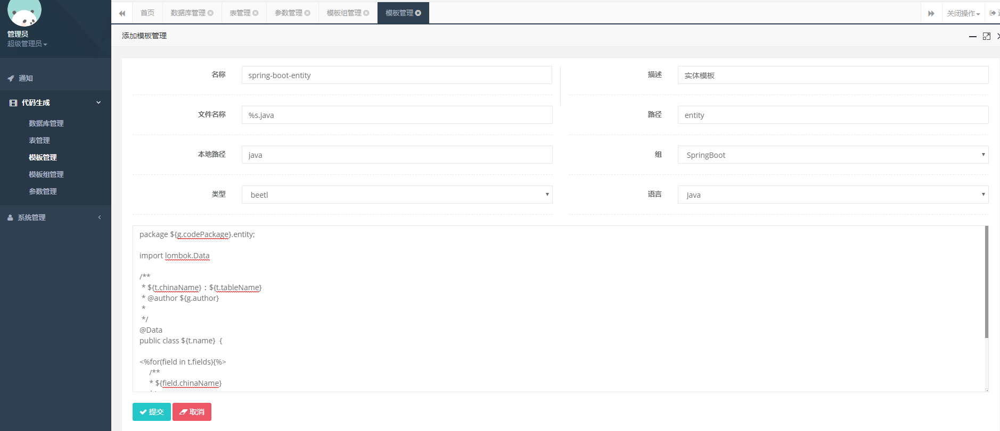

# lemur-generation

> 说明：本系统在 <https://gitee.com/lemur/lemur-generation> 的基础上进行二次开发，主要做了以下改进：
>
> 1. 增加了对 Oracle 数据库的支持；
> 2. 屏蔽部分功能。
>
> **感谢原作者的开源！**

代码托管地址

<https://github.com/zhechu/lemur-generation>

# 启动方法

1. 下载代码
2. 导入 gen.sql 的 SQL
3. 运行 GenApplication

> TIPS：具体使用方法请看**使用说明**一节。

# 模板开发

推荐使用 **[beetl](http://ibeetl.com/guide)** 模板

### 1 变量说明

#### 1.1 全局变量

| 变量          | 说明           |
| ------------- | -------------- |
| g.author      | 作者           |
| g.codePackage | 代码文件的包名 |
| t.tableName   | 表名           |
| t.name        | 类名           |
| t.chinaName   | 类的功能描述   |
| t.idName      | 主键属性名称   |
| t.idType      | 主键属性类型   |
| t.idFieldName | 数据库主键名称 |
| t.idJdbcType  | 主键 JDBC 类型 |
| t.fields      | 表字段列表     |

#### 1.2 表字段变量

| 变量      | 描述           |
| --------- | -------------- |
| fieldName | 数据库字段名称 |
| fieldType | 数据库字段类型 |
| name      | 字段属性名称   |
| type      | 字段属性类型   |
| jdbcType  | 字段 JDBC 类型 |

### 2 beetl 模板示例

<https://github.com/zhechu/lemur-generation/tree/master/gen-admin/src/main/resources/template>

# 使用说明

### 1 登录

<http://127.0.0.1:7890>

账号和密码：admin/123456

### 2 数据库管理

> 数据库管理是对数据源进行管理，目前支持的数据源有两个：Oracle 和 Mysql。

新建数据库：开发环境 Oracle

> TIPS：账号必须为 sys as sysdba，密码保守设置为数字（因为 Oracle 远程连接数据库密码有大小写敏感问题）。

### 3 参数管理

> 参数是对服务进行配置，比如：服务的包名，还有开发的作者、代码文件的编码。

新建参数：公共服务管理

> TIPS：这里 code 包对应的是服务的包名。

### 4 模板组管理

> 模板组的作用是对模板进行分类。

新建模板组：SpringBoot

### 5 模板管理

> 模板管理是对生成代码的模板进行管理。

新建模板：实体模板

> TIPS：文件名称 %s 是占位符，将会被替换为类的名称。路径是实体相对的所在包名。本地路径是相对 **src/main** 的路径。类型推荐用 **[beetl](http://ibeetl.com/guide/)** 模板。

### 6 表管理

> 表管理是对数据库的表映射进行维护，方便代码生成。

DB 导入表：学生管理报到注册表

修改表的类名和功能描述

表字段设置

> TIPS：修改表字段的名称、类型和选择主键（表导入时，程序会自动将类型设置好，但是特殊类型，不支持，所以要检查下，**重要**）

### 7 代码生成

> 将表导入并设置好之后，就可以进行生成代码了。

生成代码：测试表

生成代码会下载压缩文件，解压文件如下

> TIPS：生成的代码，复制到实际工程去后，可能会存在依赖包没导入，即文件头的 import 语句那块，有些包可能没导入，需手工处理——与相应模板相关。
